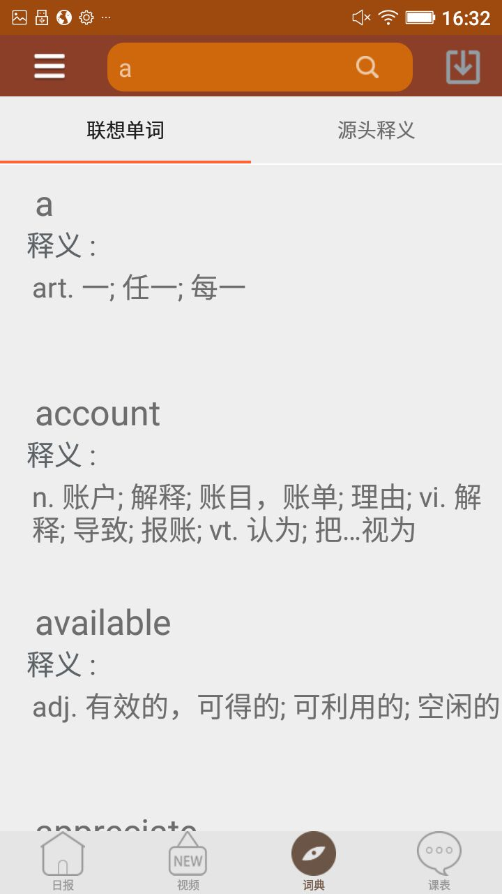
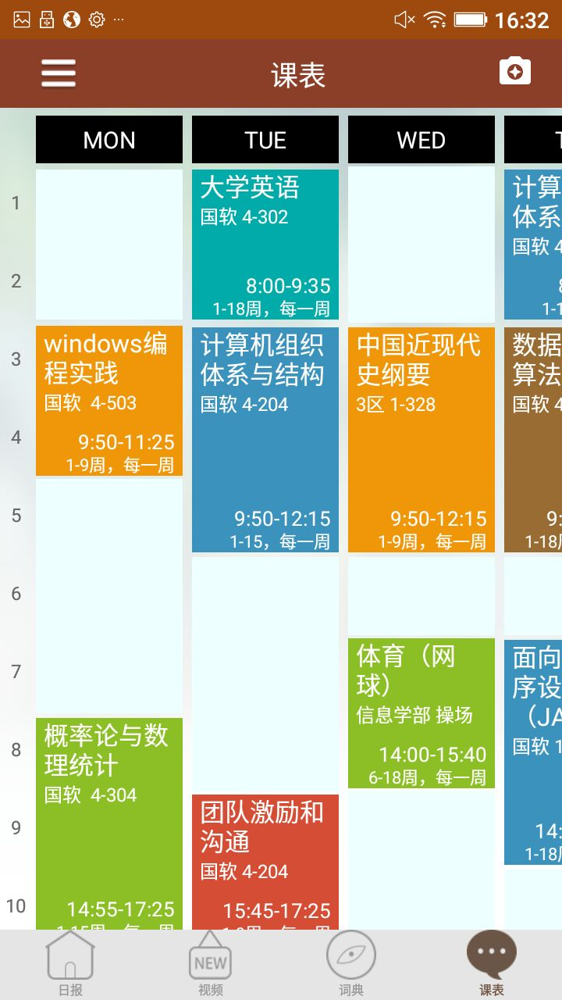
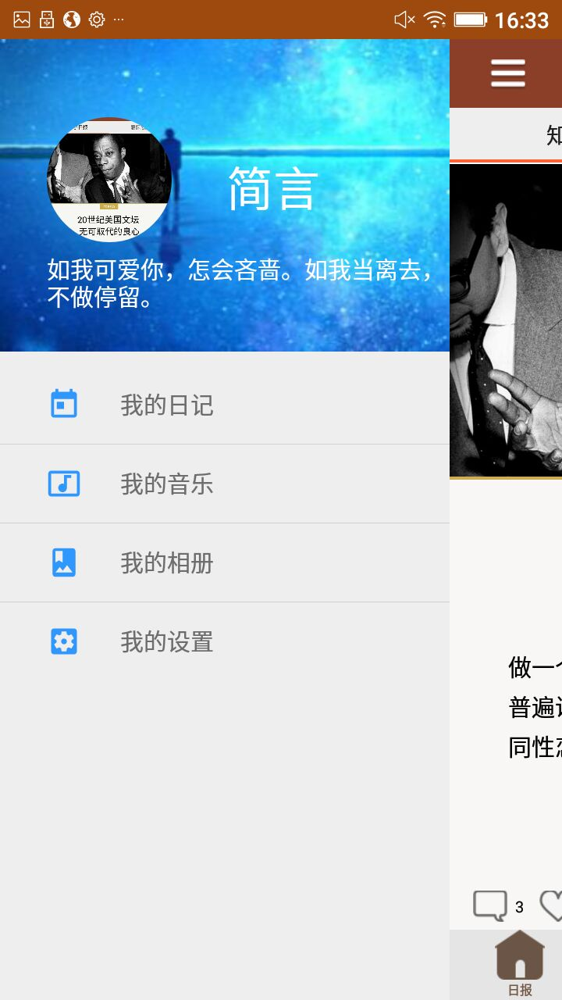

[![Platform][1]][2]

[1]:https://img.shields.io/badge/platform-Android-blue.svg  
[2]:https://github.com/iMeiji/Toutiao


# ReadNews
ReadNews客户端,是我的一个练手的习作，其中采用了MVP的架构，基于Material Design设计风格，采用了Rxjava,Retrofit,PhotoViwe,OkHttp等各种框架。


## Statement
程序中的API，来自网络上广为流API接口，本人只是用于学习使用，并没有任何的盈利行为，首页是单独客户端的接口，此页是来自头条，第三页是用的网易词典。


## Features
- 首页五大模块:  日报/ 视屏 / 词典 / 课程表 / 侧滑菜单
- 第一个模块：采用了一个垂直的ViewPage，有俩个tab
- 第二个模块：实现了html5新闻页面的阅读， 采用饺子播放器播放视频。
- 第三个模块：实现了根据关键词进行首锁单词的功能
- 第四个模块：画了一个课程表
- 第五个模块：头像可以通过拍照和从相册选择来设置，并且进行了缓冲。


## Screenshots






## Preview


##Point
- 第一个模块关键技术使音乐播放器的实现
- 第二个模块的技术关键H5调用Java，Java调用H5
- 第三个模块和第四个，主要是关键词搜索和布局的设置
- 第五个模块的关键是通过ContentProvide获取相册中的照片并返回，以及如何调用系统的照相机

##用的库有
```
    implementation(name: 'ObservableScrollView-release', ext: 'aar')
    //ButterKnife
    implementation rootProject.ext.dependence.libButterKnife
    annotationProcessor rootProject.ext.dependence.libAnnotationProcessor
    //侧滑菜单
    implementation project(':SlidingMenu_library')
    //多部局适配器
    implementation project(':MultipleItemRvAdapter')
    //UI
    implementation project(':uikit')
    //photogallery
    implementation project(':photogallery')
    //gson
    implementation rootProject.ext.dependence.retrofitGson
    //retrofit2
    implementation rootProject.ext.dependence.libRetrofit
    //adapter-rxjava 解决冲突问题
    implementation rootProject.ext.dependence.libRxJava
    //scalars
    implementation rootProject.ext.dependence.libRetrofitScalars
    //okhttp3，interceptor
    implementation rootProject.ext.dependence.libOkhttp
    //rxandroid
    implementation rootProject.ext.dependence.libRxAndroid
    //EventBus
    implementation rootProject.ext.dependence.libEventBus
    //glide
    implementation rootProject.ext.dependence.libGlide
    annotationProcessor rootProject.ext.dependence.GlideProcessor
    //StateView
    implementation 'com.github.nukc.stateview:library:1.2.1'
    //litepel 数据库
    implementation 'org.litepal.android:core:1.5.0'
    //ColorTrackTabLayout
    implementation 'me.weyye.ColorTrackTabLayout:library:1.0.1'
    implementation project(':jiaozivideoplayer')
    //PhotoView
    implementation 'com.github.chrisbanes:PhotoView:2.0.0'
    //glideimageview
    implementation 'com.sunfusheng:glideimageview:1.0.0'
    implementation 'org.jsoup:jsoup:1.11.1'
    implementation 'de.hdodenhof:circleimageview:3.0.0'
    implementation 'cc.trity.floatingactionbutton:library:1.0.0'
```

## End
注意：此开源项目仅做学习交流使用, 不可用于任何商业用途. 如果你觉得不错, 对你有帮助, 欢迎点个 fork, star, follow , 也可以帮忙分享给你更多的朋友, 这是给作者最大的动力与支持

